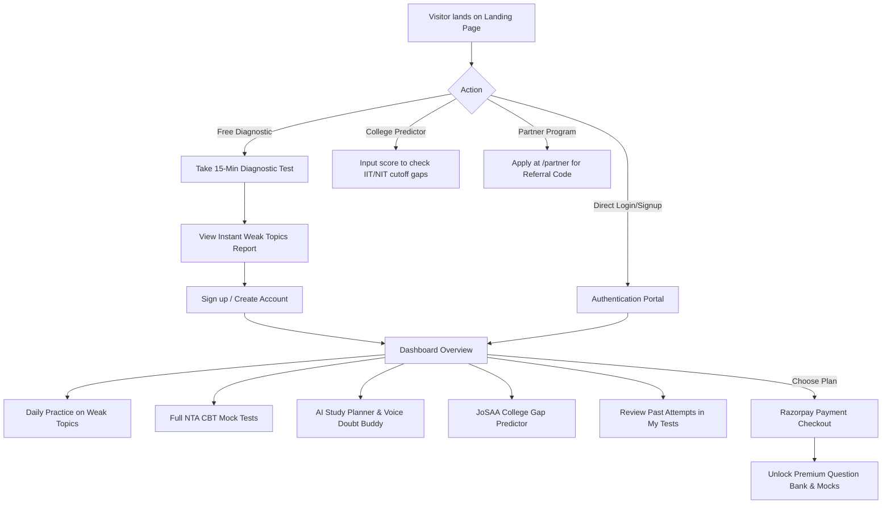

# 🎓 Dakhilaa — Client Application

> **Precision Diagnostic & Preparation Platform for JEE Main & JEE Advanced**  
> *Stop Guessing. Start Knowing.*

---

## 📖 1. Project Scenario & Vision

### The Problem
Every year, over 1.4 million students in India prepare for the Joint Entrance Examination (**JEE Main** and **JEE Advanced**) to secure admission into premier engineering institutions like the **IITs, NITs, and IIITs**. 

Most existing EdTech platforms provide massive, unfiltered question banks (often 20,000+ questions) and leave students to figure out what they need to study. Students spend hundreds of hours solving questions they already know how to do, while missing the critical 2–3 conceptual blindspots that cause negative marking and lost ranks in actual exams.

### The Dakhilaa Solution
**Dakhilaa** (meaning *"Admission"* in Hindi/Urdu) flips the traditional preparation model on its head by implementing a **Diagnostic-First, Precision-Prep Methodology**:

1. **Pinpoint Before Practicing**: Instead of endless grinding, a rapid 15-minute diagnostic test pinpoints the exact topics costing the student the most marks.
2. **Data-Driven Gap Analysis**: Compares current student performance against official **JoSAA Cutoffs** across all 23 IITs and 31 NITs, showing the exact score gap required to reach their dream branch (CSE, ECE, ME, CE).
3. **Targeted Remediation**: An intelligent **AI Study Planner**, daily 10-question weak-area drills, and flexible weekly schedules systematically eliminate weak topics.
4. **Real Exam Simulation**: Full Computer Based Test (**CBT**) arena accurately replicating the **NTA (National Testing Agency)** interface—complete with status palettes, section switching, timer countdowns, and negative marking (+4 / −1).
5. **Educator & Partner Ecosystem**: An affiliate portal enabling coaching institutes, teachers, and student mentors to track referrals, analyze conversions, and earn transparent commissions.

---

## 🚀 2. System Architecture & Folder Structure

The client application is built with **React 19** and **Vite**, adopting a modular component-driven architecture organized as follows:

```
client/
├── public/                     # Static assets (favicons, SVG icons)
├── src/
│   ├── assets/                 # Brand imagery, illustrations, robot mascot
│   ├── components/             # Reusable UI & feature components
│   │   ├── AdvancedMock/       # Multi-section JEE Advanced test simulator (MCQ, MSQ, Numerical, Match)
│   │   ├── AIPlanner/          # AI Study Buddy chat with Web Speech API voice input
│   │   ├── Blog/               # JEE strategy articles & markdown post viewer
│   │   ├── CollegePredictor/   # Cutoff analyzer & college gap prediction engine
│   │   ├── Common/             # Reusable modals (e.g., Razorpay payment modal)
│   │   ├── Feedback/           # User rating and testimonial submission modal
│   │   ├── FlexibleSchedule/   # Custom 7-day timetable planner based on study hours
│   │   ├── Header/             # Top dashboard navigation bar & user profile chip
│   │   ├── LandingPredictor/   # Interactive cutoff calculator on the homepage
│   │   ├── LiveTestArena/      # Real-time scheduled CBT exam arena with countdown
│   │   ├── MockTest/           # Full NTA JEE Main pattern test engine & Hub
│   │   ├── MyTests/            # Comprehensive past test logs & solution analysis
│   │   ├── Overview/           # Student command center with stats, streaks & quick launch
│   │   ├── Partner/            # Partner application page & real-time affiliate dashboard
│   │   ├── PlanChooser/        # Tier selection & feature comparison modal
│   │   ├── Progress/           # Historical test scores & visual performance trends
│   │   ├── QuestionBank/       # Subject & difficulty filtered practice portal
│   │   ├── Sidebar/            # Collapsible navigation drawer for the student portal
│   │   ├── Stats/              # Detailed metrics & accuracy breakdown
│   │   ├── SupportBot/         # Floating support widget + Priority Support desk
│   │   ├── Testimonials/       # Rolling verified student reviews
│   │   ├── WeakTopics/         # Accuracy-sorted list of high-priority weak areas
│   │   └── MathText.jsx        # KaTeX LaTeX formula rendering component
│   ├── context/
│   │   └── AuthContext.jsx     # Supabase session provider & authentication context
│   ├── data/
│   │   └── planData.js         # Pricing tiers, feature permissions & navigation routes
│   ├── hooks/
│   │   ├── useProfile.js       # Hook for fetching & syncing student profile from Supabase
│   │   ├── useScrollReveal.js  # IntersectionObserver hook for smooth scroll animations
│   │   └── useStats.js         # Aggregator hook calculating accuracy, totals & test logs
│   ├── layouts/                # Shared page shell templates
│   ├── lib/
│   │   └── supabase.js         # Supabase client initialization
│   ├── pages/                  # Top-level view routes
│   │   ├── Auth.jsx            # Sign up, Log in & Password Recovery form
│   │   ├── Dashboard.jsx       # Authenticated student portal host
│   │   ├── Diagnostic.jsx      # Adaptive 15-minute diagnostic test runner
│   │   ├── Landing.jsx         # Public marketing landing page & product showcase
│   │   └── ResetPassword.jsx   # Supabase recovery callback page
│   ├── App.jsx                 # Client router, route guards & session storage manager
│   ├── index.css               # Global theme variables, design tokens & reset
│   └── main.jsx                # React DOM entry point
├── .env                        # Local environment variables
├── package.json                # Project dependencies and npm scripts
└── vite.config.js              # Vite configuration & React plugin setup
```

---

## ⚡ 3. Detailed Feature Breakdown

### 🎯 1. 15-Minute Diagnostic Test (`Diagnostic.jsx`)
- **Adaptive Questioning**: Fetches diagnostic questions across Physics, Chemistry, and Mathematics from Supabase.
- **LaTeX Math Support**: Mathematical equations, chemical formulas, and fractions rendered with KaTeX via [`MathText.jsx`](file:///c:/Users/hp/Downloads/dakhilaa/client/src/components/MathText.jsx).
- **Exam UI**: Real-time 15-minute countdown timer, question palette navigation, and instant progress tracking.
- **Instant Diagnostic Report**: Evaluates topic accuracy; any topic with `<60%` accuracy is flagged as a critical weak area.
- **Persistent Storage**: Stores attempt summary into `attempts` table and question-by-question choices into `attempt_answers`.

### 📊 2. Student Dashboard & Overview (`Dashboard.jsx`, `Overview.jsx`)
- **Command Center**: Shows active subscription tier, current preparation score (e.g. `185/300`), accuracy rate, and total solved questions.
- **Quick Launchers**: Single-click access to Daily Practice, Mock Tests, Weak Topics, or AI Study Buddy.
- **Dynamic Paywalls**: Seamlessly gates premium modules (Question Bank, Mock Tests, AI Planner) for free accounts with one-click upgrade triggers.

### 📝 3. NTA-Style Computer Based Test (CBT) Engine (`MockTest.jsx`, `MockTestHub.jsx`)
- **Authentic NTA Color-Coded Palette**:
  - ⚪ *Not Visited*
  - 🔴 *Not Answered*
  - 🟢 *Answered*
  - 🟣 *Marked for Review*
  - 🟣🟢 *Answered & Marked for Review*
- **Modes**:
  - **Full JEE Main Mock**: 75 questions (25 Physics, 25 Chemistry, 25 Maths), 180 minutes, official `+4` / `−1` marking rules.
  - **Chapter-Wise Tests**: Dedicated 10–15 question targeted tests for individual topics.
  - **JEE Advanced Multi-Section Simulator**: Supports complex patterns including Multiple Choice (MCQ), Multi-Select (MSQ), Numerical Value Type, and Matrix Matching.
- **Test Results**: Detailed breakdown of score, time spent, positive/negative marks, subject-wise scores, and full solutions.

### 💻 4. Live Test Arena (`LiveTestArena.jsx`)
- Simulates real exam-day conditions with scheduled nationwide mock test windows.
- Live ticking countdown to scheduled start times.
- Auto-opens the test during the active window and logs test attempts for rank prediction.

### 🏆 5. College Predictor (`CollegePredictor.jsx`, `LandingPredictor.jsx`)
- Evaluates student's score against historical **JoSAA Opening and Closing Ranks/Cutoffs**.
- Covers **23 IITs** (Bombay, Delhi, Madras, Kanpur, Kharagpur, etc.) and **31 NITs** (Trichy, Surathkal, Warangal, Calicut, etc.).
- Computes branch-wise cutoff status across **CSE, ECE, ME, and CE**:
  - 🟢 **Safe**: Student meets or exceeds cutoff.
  - 🟡 **Moderate**: Gap is within 20 marks.
  - 🔴 **Reach**: Score gap requires targeted revision.
- Provides actionable recommendations to bridge the score gap.

### 🤖 6. AI Study Planner & Voice Buddy (`AIPlanner.jsx`)
- **Weak-Topic Aware**: Reads student's actual weak areas from Supabase and formulates multi-day revision roadmaps.
- **Voice-Enabled Input**: Integrated with the browser's **Web Speech API** (`SpeechRecognition` with `en-IN` language support) allowing students to ask doubts verbally.
- **Custom Study Schedules**: Formulates daily tasks, revision cycles, and mock milestones.
- **Motivational Encouragement**: Built-in support prompts to reduce exam stress and encourage consistency.

### 📚 7. Question Bank (`QuestionBank.jsx`)
- Curated repository of thousands of JEE-standard questions.
- Multi-dimensional filters: Subject (`Physics`, `Chemistry`, `Maths`) and Difficulty (`Easy`, `Medium`, `Hard`).
- Immediate answer checking, KaTeX math formatting, and detailed conceptual solutions.

### 🗓️ 8. Flexible Study Timetable (`FlexibleSchedule.jsx`)
- Generates a customized 7-day study schedule based on student's daily available study hours and target exam date.
- Employs a smart algorithm: **50% of study blocks are dedicated to weakest topics**, with remaining hours rotating across general subject revision.

### 📄 9. Test History & Question Review (`MyTests.jsx`)
- Historical log of all diagnostic, chapter, and mock attempts.
- In-depth question-by-question post-exam review.
- Toggle between all questions and **"Only Wrong Answers"** for error analysis.

### 💬 10. Dual-Layer Support System (`SupportBot.jsx`, `PrioritySupport.jsx`)
- **Fast Rule Engine**: Instant answers for common questions regarding pricing, refunds, diagnostic details, and signup.
- **AI Fallback**: Automatically invokes Supabase Edge Function (`chat-support`) for complex subject doubts or custom inquiries.
- **Priority Desk**: Dedicated high-priority support channel for paid bundle subscribers.

### 🤝 11. Partner & Educator Affiliate Portal (`PartnerSection.jsx`, `PartnerDashboard.jsx`)
- Public educator registration and onboarding workflow at `/partner`.
- Custom referral links: `https://dakhilaa.com/ref/{REFERRAL_CODE}`.
- Complete business dashboard:
  - 20% transparent commission tracking.
  - Gross student revenue generated and net earnings.
  - Referral conversions log and monthly payout scheduling.

### 💳 12. Monetization & Checkout (`RazorpayModal.jsx`, `planData.js`)
- Integrated with **Razorpay** payment gateway.
- Four structured tiers:
  - **Free Tier**: 15-Minute Diagnostic Test & Weakness Report.
  - **Mains Prep Plan (₹799/year)**: 10,000 Questions, 30 Chapter Tests, NIT Predictor.
  - **Advanced Prep Plan (₹899/year)**: 5,000 Advanced Questions, 50 Advanced Mocks, IIT Predictor.
  - **Mains + Advanced Bundle (₹1,099/year)**: Unlimited access to all question banks, 100+ mocks, AI Planner, dual predictors, and priority support.
- Automatic referral discount and attribution application.

---

## 🛠️ 4. Tech Stack & Dependencies

| Category | Technologies / Libraries |
| :--- | :--- |
| **Framework** | [React 19](https://react.dev/) + [Vite 8](https://vite.dev/) |
| **Routing** | [React Router DOM v7](https://reactrouter.com/) + Session State Routing |
| **Backend & Database** | [Supabase](https://supabase.com/) (Auth, PostgreSQL DB, Edge Functions, Row-Level Security) |
| **Mathematics & Formula Rendering** | [KaTeX](https://katex.org/) + [react-katex](https://github.com/talyssonoc/react-katex) |
| **Markdown Processing** | [react-markdown](https://github.com/remarkjs/react-markdown) |
| **Payment Gateway** | [Razorpay](https://razorpay.com/) Web Checkout Integration |
| **Voice Interface** | Browser Native Web Speech API (`SpeechRecognition`) |
| **HTTP Client** | [Axios](https://axios-http.com/) |
| **Styling** | Modern Vanilla CSS with CSS Custom Properties (Theme tokens, glassmorphism, responsive flex/grid) |

---

## 🗄️ 5. Supabase Database Schema Overview

The client interacts with the following Supabase tables:

- `profiles`: User information, full name, phone, chosen subscription plan (`free`, `mains`, `advanced`, `bundle`).
- `questions`: Question repository containing `subject`, `topic`, `difficulty`, `question_text`, options `a`, `b`, `c`, `d`, `correct_option`, `solution_text`, `is_diagnostic`, and `exam_type`.
- `attempts`: Test history record with `user_id`, `score_percent`, `correct_count`, `total_questions`, `weak_topics` (JSON array), and `time_taken_seconds`.
- `attempt_answers`: Detailed question log per attempt linking `attempt_id`, `question_id`, `selected_option`, and `is_correct`.
- `scheduled_tests`: Live CBT event configuration with `title`, `scheduled_at`, and `duration_minutes`.
- `blog_posts`: Public articles with `title`, `slug`, `excerpt`, `content`, `cover_image`, `author`, and `published` status.
- `testimonials`: Student feedback submitted via the UI and displayed on the homepage upon admin approval.
- `partners`: Registered affiliate partners with `email`, `referral_code`, `status` (`pending`, `approved`), and payout information.
- `referrals`: Sales records tracking `referral_code`, `amount`, and `commission`.

---
## Backend Architecture

### Backend DFD & System Design

The following diagram represents the Level 0 and Level 1 Data Flow Diagram (DFD) and the high-level backend system architecture of Dakhilaa.

![Dakhilaa Backend DFD and System Design]

## ⚙️ 6. Getting Started & Local Setup

### Prerequisites
- [Node.js](https://nodejs.org/) (version 18 or above recommended)
- `npm` or `yarn` / `pnpm`
- A configured Supabase project instance

### Installation

1. Navigate to the client directory:
   ```bash
   cd client
   ```

2. Install dependencies:
   ```bash
   npm install
   ```

3. Configure Environment Variables:  
   Create or verify the `.env` file in the `client/` directory with the following variables:
   ```env
   VITE_SUPABASE_URL=https://your-project.supabase.co
   VITE_SUPABASE_PUBLISHABLE_KEY=your-anon-publishable-key
   ```

4. Launch the local development server:
   ```bash
   npm run dev
   ```
   Open your browser and navigate to `http://localhost:5173`.

5. Build for Production:
   ```bash
   npm run build
   ```
   The compiled production assets will be generated in the `dist/` directory.

---

## 📱 7. User Journeys



---

## 🛡️ 8. Security & Best Practices

- **Row Level Security (RLS)**: Sensitive user metrics and partner transactions are safeguarded through Supabase RLS policies.
- **Client Sanitization**: All LaTeX expressions and Markdown entries are parsed safely through KaTeX and React Markdown.
- **Zero-Secret Client Exposure**: Only public/anon Supabase keys are bundled in client environment variables; private service roles and webhook secrets remain secure on Supabase Edge functions.

---

## 📄 License & Ownership
Copyright © 2026 **Dakhilaa**. All rights reserved.  
For inquiries or support, reach out to `Support@dakhilaa.com`.
